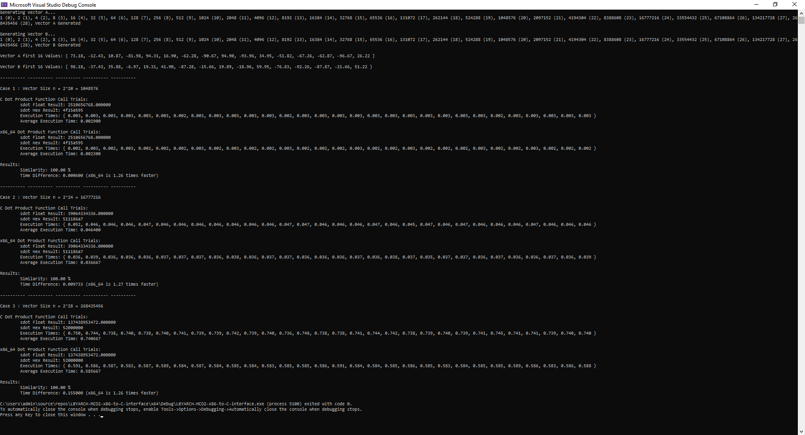
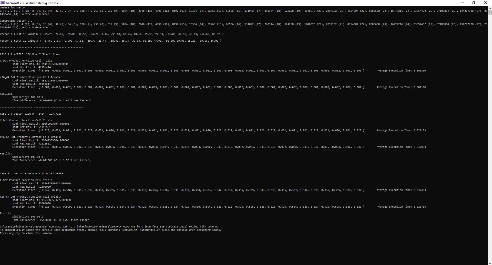

# LBYARCH-MCO2-x86-to-C-interface
This project serves as partial fulfillment of the LBYARCH Course

Tean Concio XX22  
Nicole Ong S11  

## A. Specifications
The project comprises two kernels in C and x86-64 Assembly which computes for dot products between two vectors A and B. Both C and x86-64 Assembly kernels are timed then compared to each other in Debug Configuration and Release Configuration of Visual Studio.

**Input:**  
Scalar variable n (integer) contains the length of the vector; Vectors A and B are both single-precision float. Scalar sdot is a single-precision float.

**Output**  
 Store the result in memory locaon sdot. Display the result for all versions of the kernel (i.e., C and x86-64).

## B. The Program Output

### 1a. Setup: Debug Mode

Generating Vector A...
1 (0), 2 (1), 4 (2), 8 (3), 16 (4), 32 (5), 64 (6), 128 (7), 256 (8), 512 (9), 1024 (10), 2048 (11), 4096 (12), 8192 (13), 16384 (14), 32768 (15), 65536 (16), 131072 (17), 262144 (18), 524288 (19), 1048576 (20), 2097152 (21), 4194304 (22), 8388608 (23), 16777216 (24), 33554432 (25), 67108864 (26), 134217728 (27), 268435456 (28), Vector A Generated

Generating Vector B...
1 (0), 2 (1), 4 (2), 8 (3), 16 (4), 32 (5), 64 (6), 128 (7), 256 (8), 512 (9), 1024 (10), 2048 (11), 4096 (12), 8192 (13), 16384 (14), 32768 (15), 65536 (16), 131072 (17), 262144 (18), 524288 (19), 1048576 (20), 2097152 (21), 4194304 (22), 8388608 (23), 16777216 (24), 33554432 (25), 67108864 (26), 134217728 (27), 268435456 (28), Vector B Generated

Vector A first 16 Values: { 73.18, -12.43, 10.87, -81.98, 94.31, 16.90, -62.28, -90.67, 94.90, -93.96, 34.95, -51.82, -67.26, -62.87, -96.67, 26.22 }

Vector B first 16 Values: { 98.18, -37.43, 35.88, -6.97, 19.31, 41.90, -87.28, -15.66, 19.89, -18.96, 59.95, -76.83, -92.26, -87.87, -21.66, 51.22 }

---

### 1b. Setup: Release Mode
Generating Vector A...
1 (0), 2 (1), 4 (2), 8 (3), 16 (4), 32 (5), 64 (6), 128 (7), 256 (8), 512 (9), 1024 (10), 2048 (11), 4096 (12), 8192 (13), 16384 (14), 32768 (15), 65536 (16), 131072 (17), 262144 (18), 524288 (19), 1048576 (20), 2097152 (21), 4194304 (22), 8388608 (23), 16777216 (24), 33554432 (25), 67108864 (26), 134217728 (27), 268435456 (28), Vector A Generated

Generating Vector B...
1 (0), 2 (1), 4 (2), 8 (3), 16 (4), 32 (5), 64 (6), 128 (7), 256 (8), 512 (9), 1024 (10), 2048 (11), 4096 (12), 8192 (13), 16384 (14), 32768 (15), 65536 (16), 131072 (17), 262144 (18), 524288 (19), 1048576 (20), 2097152 (21), 4194304 (22), 8388608 (23), 16777216 (24), 33554432 (25), 67108864 (26), 134217728 (27), 268435456 (28), Vector B Generated

Vector A first 16 Values: { -75.75, 77.85, -32.09, 32.58, -94.77, 0.44, -93.40, 63.74, 10.14, 35.38, 22.99, -73.80, 64.96, 40.23, -64.66, 89.02 }

Vector B first 16 Values: { -0.75, 2.85, -57.09, 57.58, -19.77, 25.44, -18.40, 88.74, 35.14, 60.39, 47.99, -98.80, 89.96, 65.23, -89.66, 14.02 }

---

### 2a. Comparative Execution Time: Debug

**Case 1 : Vector Size n = 2^20 = 1048576**

**C Dot Product Function Call Trials:**  
        **Execution Times:** { 0.003, 0.003, 0.003, 0.003, 0.003, 0.003, 0.002, 0.003, 0.003, 0.003, 0.003, 0.003, 0.002, 0.003, 0.003, 0.003, 0.003, 0.003, 0.003, 0.003, 0.003, 0.003, 0.003, 0.003, 0.002, 0.003, 0.003, 0.003, 0.003, 0.003 }  
        **Average Execution Time:** 0.002900

**x86_64 Dot Product Function Call Trials:**  
        **Execution Times:** { 0.002, 0.003, 0.002, 0.003, 0.002, 0.002, 0.002, 0.003, 0.002, 0.003, 0.002, 0.002, 0.003, 0.002, 0.002, 0.002, 0.003, 0.002, 0.002, 0.003, 0.002, 0.002, 0.002, 0.003, 0.002, 0.002, 0.003, 0.002, 0.002, 0.002 }  
        **Average Execution Time:** 0.002300

**Results:**  
        **Similarity:** 100.00 %  
        **Time Difference:** 0.000600 (x86_64 is 1.26 times faster)

---

**Case 2 : Vector Size n = 2^24 = 16777216**

**C Dot Product Function Call Trials:**  
        **Execution Times:** { 0.052, 0.046, 0.046, 0.046, 0.047, 0.046, 0.046, 0.046, 0.046, 0.046, 0.046, 0.046, 0.047, 0.047, 0.046, 0.046, 0.046, 0.047, 0.046, 0.045, 0.047, 0.046, 0.047, 0.046, 0.046, 0.046, 0.047, 0.046, 0.046, 0.046 }  
        **Average Execution Time:** 0.046400

**x86_64 Dot Product Function Call Trials:**  
        **Execution Times:** { 0.036, 0.039, 0.036, 0.036, 0.036, 0.037, 0.037, 0.037, 0.036, 0.038, 0.036, 0.037, 0.037, 0.036, 0.036, 0.036, 0.037, 0.036, 0.038, 0.037, 0.03s, 0.037, 0.037, 0.036, 0.037, 0.036, 0.036, 0.037, 0.036, 0.039 }  
        **Average Execution Time:** 0.036667

**Results:**  
        **Similarity:** 100.00 %  
        **Time Difference:** 0.009733 (x86_64 is 1.27 times faster)

---

**Case 3 : Vector Size n = 2^28 = 268435456**

**C Dot Product Function Call Trials:**  
        **Execution Times:** { 0.750, 0.744, 0.738, 0.740, 0.738, 0.740, 0.741, 0.739, 0.739, 0.742, 0.739, 0.740, 0.736, 0.748, 0.738, 0.738, 0.741, 0.744, 0.742, 0.738, 0.739, 0.740, 0.739, 0.741, 0.745, 0.741, 0.741, 0.739, 0.740, 0.740 }  
        **Average Execution Time:** 0.740667

**x86_64 Dot Product Function Call Trials:**  
        **Execution Times:** { 0.591, 0.586, 0.587, 0.583, 0.587, 0.589, 0.584, 0.587, 0.584, 0.585, 0.584, 0.583, 0.585, 0.585, 0.586, 0.591, 0.584, 0.584, 0.585, 0.586, 0.585, 0.583, 0.584, 0.585, 0.585, 0.589, 0.586, 0.583, 0.586, 0.588 }  
        **Average Execution Time:** 0.585667

**Results:**
        **Similarity:** 100.00 %  
        **Time Difference:** 0.155000 (x86_64 is 1.26 times faster)

| Case              |     C    |  x86-64  | Similarity |
| :---------------- |  :------ |  :------ | :--------- |
| 2^20 = 1048576    | 0.002900 | 0.002300 |  100.00%   |
| 2^24 = 16777216   | 0.046400 | 0.036667 |  100.00%   |
| 2^28 = 268435456  | 0.740667 | 0.585667 |  100.00%   |

---

### 2b. Comparative Execution Time: Release

**Case 1 : Vector Size n = 2^20 = 1048576**

**C Dot Product Function Call Trials:**  
        **Execution Times:** { 0.001, 0.002, 0.001, 0.001, 0.001, 0.002, 0.001, 0.001, 0.001, 0.002, 0.001, 0.002, 0.001, 0.001, 0.001, 0.002, 0.001, 0.001, 0.002, 0.001, 0.001, 0.002, 0.001, 0.001, 0.002, 0.001, 0.001, 0.002, 0.001, 0.001 }   
        **Average Execution Time:** 0.001300

**x86_64 Dot Product Function Call Trials:**  
        **Execution Times:** { 0.002, 0.002, 0.002, 0.002, 0.002, 0.003, 0.002, 0.002, 0.002, 0.002, 0.003, 0.002, 0.002, 0.002, 0.002, 0.002, 0.002, 0.003, 0.002, 0.002, 0.002, 0.002, 0.002, 0.002, 0.002, 0.002, 0.002, 0.002, 0.002, 0.002 }  
        **Average Execution Time:** 0.002100

**Results:**  
        **Similarity:** 100.00 %  
        **Time Difference:** -0.000800 (C is 1.62 times faster)

---

**Case 2 : Vector Size n = 2^24 = 16777216**

**C Dot Product Function Call Trials:**  
        **Execution Times:** { 0.025, 0.023, 0.021, 0.021, 0.020, 0.021, 0.020, 0.021, 0.021, 0.021, 0.021, 0.022, 0.021, 0.021, 0.021, 0.020, 0.021, 0.021, 0.021, 0.021, 0.021, 0.022, 0.021, 0.021, 0.021, 0.020, 0.021, 0.020, 0.021, 0.022 }  
        **Average Execution Time:** 0.021133

**x86_64 Dot Product Function Call Trials:**  
        **Execution Times:** { 0.032, 0.035, 0.033, 0.032, 0.033, 0.032, 0.033, 0.036, 0.033, 0.032, 0.033, 0.034, 0.033, 0.034, 0.033, 0.032, 0.033, 0.033, 0.032, 0.033, 0.033, 0.033, 0.032, 0.032, 0.033, 0.032, 0.035, 0.033, 0.032, 0.032 }  
        **Average Execution Time:** 0.032933

**Results:**  
        **Similarity:** 100.00 %  
        **Time Difference:** -0.011800 (C is 1.56 times faster)

---

**Case 3 : Vector Size n = 2^28 = 268435456**

**C Dot Product Function Call Trials:**  
        **Execution Times:** { 0.347, 0.341, 0.340, 0.341, 0.339, 0.338, 0.335, 0.335, 0.338, 0.335, 0.336, 0.338, 0.335, 0.337, 0.338, 0.334, 0.342, 0.337, 0.335, 0.335, 0.343, 0.335, 0.335, 0.337, 0.336, 0.336, 0.336, 0.335, 0.337, 0.337 }  
        **Average Execution Time:** 0.337433

**x86_64 Dot Product Function Call Trials:**  
        **Execution Times:** { 0.528, 0.525, 0.529, 0.523, 0.526, 0.524, 0.525, 0.524, 0.524, 0.526, 0.525, 0.525, 0.524, 0.526, 0.530, 0.524, 0.526, 0.525, 0.526, 0.525, 0.525, 0.525, 0.524, 0.534, 0.526, 0.527, 0.526, 0.526, 0.526, 0.523 }  
        **Average Execution Time:** 0.525733

**Results:**  
        **Similarity:** 100.00 %  
        **Time Difference:** -0.188300 (C is 1.56 times faster)

| Case              |     C    |  x86-64  | Similarity |
| :---------------- |  :------ |  :------ | :--------- |
| 2^20 = 1048576    | 0.001300 | 0.002100 |  100.00%   |
| 2^24 = 16777216   | 0.021133 | 0.032933 |  100.00%   |
| 2^28 = 268435456  | 0.337433 | 0.525733 |  100.00%   |

---

### 3a. Analysis: Debug

| Case              | Time Difference| Faster Language | Magnitude |
| :---------------- |  :------------ | :-------------- | :-------- |
| 2^20 = 1048576    |    0.000600    |      x86-64     |   1.26x   | 
| 2^24 = 16777216   |    0.009733    |      x86-64     |   1.27x   | 
| 2^28 = 268435456  |    0.155000    |      x86-64     |   1.26x   | 

From a theoretical point of view, Assembly can be said to be one of the the fastest programming languages. Being a low level language, Assembly is much more similar to machine language than a high level language like C. This gives the programmer more control, as high level languages can takes time more time to compile and can introduce inefficiencies and more overhead.

To test this, the project implemented a dot product calculator in C and x86-64 Assembly and run in Debug Configuration. As can be seen in the table, x86-64 Assembly was shown to have consistently faster performance compared to C. However, this performance can be attributed to Debug Configuration compiling the program with no optimization in order to keep debugging simple. Furthermore, Debug Configuration, as the name suggests, also generates debug information, which could also be a factor affecting the speed of the program.

---

### 3b. Analysis: Release
| Case              | Time Difference| Faster Language | Magnitude |
| :---------------- |  :------------ | :-------------- | :-------- |
| 2^20 = 1048576    |    -0.000800   |        C        |   1.62x   | 
| 2^24 = 16777216   |    -0.011800   |        C        |   1.56x   | 
| 2^28 = 268435456  |    -0.188300   |        C        |   1.56x   |  

When run in Release Configuration, C is shown to be faster than x86-64 Assembly. In Release Configuration, C code is fully optimized. As such, the speed of the C code increases and outdoes x86-64 Assembly in terms of speed.

---

### 4. Conclusion

In theory, x86-64 Assembly can be considered one of the fastest programming languages due to its low level nature. This makes it ideal for performing tasks such as computation if speed is needed. However, the effectivity of Assembly still depends on the skill of the programmer. As seen in the Release Configuration, a well optimized C code can outperform an Assembly code performing the same task. Therefore, it is still up to the programmer to decide which language is ideal for their situation. 

---

### Output with Correctness Check

#### Debug

#### Release

