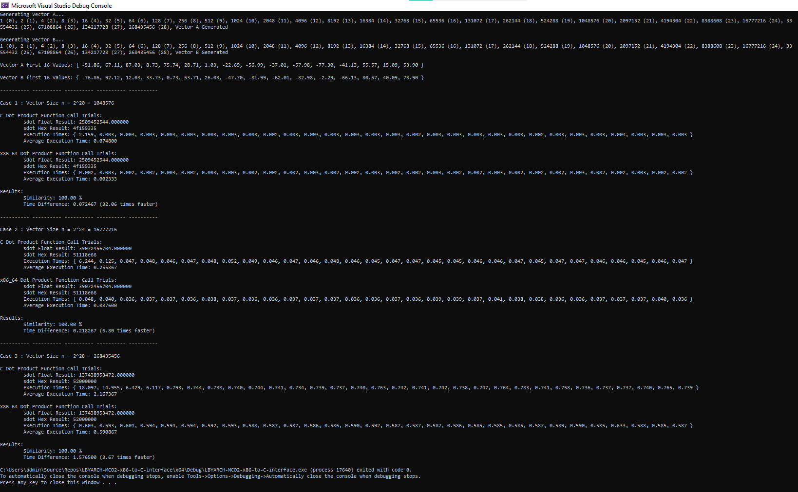

# LBYARCH-MCO2-x86-to-C-interface
This project serves as partial fulfillment of the LBYARCH Course

Tean Concio XX22  
Nicole Ong S11
- [LBYARCH-MCO2-x86-to-C-interface](#lbyarch-mco2-x86-to-c-interface)
  - [Specifications](#specifications)
    - [Input:](#input)
    - [Output](#output)
  - [The Program Output](#the-program-output)
  - [Comparative Execution Time](#comparative-execution-time)
    - [Case 1 : Vector Size n = 2^20 = 1048576](#case-1--vector-size-n--220--1048576)
    - [Case 2 : Vector Size n = 2^24 = 16777216](#case-2--vector-size-n--224--16777216)
    - [Case 3 : Vector Size n = 2^28 = 268435456](#case-3--vector-size-n--228--268435456)
  - 
  - [Analysis](#analysis)
  - [Output with Correctness Check](#output-with-correctness-check)

## Specifications
The project comprises two kernels in C and x86-64 Assembly which computes for dot products between two vectors A and B.

### Input:
Scalar variable n (integer) contains the length of the vector; Vectors A and B are both single-precision float. Scalar sdot is a single-precision float.

### Output
 Store the result in memory locaon sdot. Display the result for all versions of the kernel (i.e., C and x86-64).

 ## The Program Output
Generating Vector A...
1 (0), 2 (1), 4 (2), 8 (3), 16 (4), 32 (5), 64 (6), 128 (7), 256 (8), 512 (9), 1024 (10), 2048 (11), 4096 (12), 8192 (13), 16384 (14), 32768 (15), 65536 (16), 131072 (17), 262144 (18), 524288 (19), 1048576 (20), 2097152 (21), 4194304 (22), 8388608 (23), 16777216 (24), 33554432 (25), 67108864 (26), 134217728 (27), 268435456 (28), Vector A Generated

Generating Vector B...
1 (0), 2 (1), 4 (2), 8 (3), 16 (4), 32 (5), 64 (6), 128 (7), 256 (8), 512 (9), 1024 (10), 2048 (11), 4096 (12), 8192 (13), 16384 (14), 32768 (15), 65536 (16), 131072 (17), 262144 (18), 524288 (19), 1048576 (20), 2097152 (21), 4194304 (22), 8388608 (23), 16777216 (24), 33554432 (25), 67108864 (26), 134217728 (27), 268435456 (28), Vector B Generated

Vector A first 16 Values: { -51.86, 67.11, 87.03, 8.73, 75.74, 28.71, 1.03, -22.69, -56.99, -37.01, -57.98, -77.30, -41.13, 55.57, 15.09, 53.90 }

Vector B first 16 Values: { -76.86, 92.12, 12.03, 33.73, 0.73, 53.71, 26.03, -47.70, -81.99, -62.01, -82.98, -2.29, -66.13, 80.57, 40.09, 78.90 }

## Comparative Execution Time
### Case 1 : Vector Size n = 2^20 = 1048576

**C Dot Product Function Call Trials:**  
        **Execution Times:**
        { 2.159, 0.003, 0.003, 0.003, 0.003, 0.003, 0.003, 0.003, 0.003, 0.002, 0.003, 0.003, 0.003, 0.003, 0.003, 0.003, 0.002, 0.003, 0.003, 0.003, 0.003, 0.003, 0.002, 0.003, 0.003, 0.003, 0.004, 0.003, 0.003, 0.003 }  
        **Average Execution Time:** 0.074800

**x86_64 Dot Product Function Call Trials:**  
        **Execution Times:** 
        { 0.002, 0.003, 0.002, 0.002, 0.003, 0.002, 0.003, 0.003, 0.002, 0.002, 0.002, 0.003, 0.002, 0.002, 0.003, 0.002, 0.002, 0.003, 0.002, 0.002, 0.003, 0.002, 0.002, 0.002, 0.003, 0.002, 0.002, 0.003, 0.002, 0.002 }  
        **Average Execution Time:** 0.002333

**Results:**  
        **Similarity:** 100.00 %  
        **Time Difference:** 0.072467 (32.06 times faster)

---------- ---------- ---------- ---------- ----------

### Case 2 : Vector Size n = 2^24 = 16777216

**C Dot Product Function Call Trials:**
        **Execution Times:** { 6.244, 0.125, 0.047, 0.048, 0.046, 0.047, 0.048, 0.052, 0.049, 0.046, 0.047, 0.046, 0.048, 0.046, 0.045, 0.047, 0.047, 0.045, 0.045, 0.046, 0.046, 0.047, 0.045, 0.047, 0.047, 0.046, 0.046, 0.045, 0.046, 0.047 }  
        **Average Execution Time:** 0.255867

**x86_64 Dot Product Function Call Trials:**  
        **Execution Times:** { 0.048, 0.040, 0.036, 0.037, 0.037, 0.036, 0.038, 0.037, 0.036, 0.036, 0.037, 0.037, 0.037, 0.036, 0.036, 0.037, 0.036, 0.039, 0.039, 0.037, 0.041, 0.038, 0.038, 0.036, 0.036, 0.037, 0.037, 0.037, 0.040, 0.036 }  
        **Average Execution Time:** 0.037600

**Results:**  
        **Similarity:** 100.00 %  
        **Time Difference:** 0.218267 (6.80 times faster)

---------- ---------- ---------- ---------- ----------

### Case 3 : Vector Size n = 2^28 = 268435456

**C Dot Product Function Call Trials:**  
        **Execution Times:** { 18.097, 14.955, 6.429, 6.117, 0.793, 0.744, 0.738, 0.740, 0.744, 0.741, 0.734, 0.739, 0.737, 0.740, 0.763, 0.742, 0.741, 0.742, 0.738, 0.747, 0.764, 0.783, 0.741, 0.758, 0.736, 0.737, 0.737, 0.740, 0.765, 0.739 }  
        **Average Execution Time:** 2.167367

**x86_64 Dot Product Function Call Trials:**  
        **Execution Times:** { 0.603, 0.593, 0.601, 0.594, 0.594, 0.594, 0.592, 0.593, 0.588, 0.587, 0.587, 0.586, 0.586, 0.590, 0.592, 0.587, 0.587, 0.587, 0.586, 0.585, 0.585, 0.585, 0.587, 0.589, 0.590, 0.585, 0.633, 0.588, 0.585, 0.587 }  
        **Average Execution Time:** 0.590867

**Results:**  
        **Similarity:** 100.00 %  
        **Time Difference:** 1.576500 (3.67 times faster)

##
As can be seen across all cases, x86-64 Assembly is shown to have faster execution time compared to C when solving for Dot Product. In cases of 2^20, 2^24, 2^28 vector size, x86-64 Assembly was tested to have 32.06 times, 6.80 times, and 3.67 times faster performance compared to C, respectively.

 ## Analysis
From a theoretical point of view, Assembly can be said to be one of the the fastest programming languages, assuming most optimized implementations for all languages. Being a low level language, Assembly is much more similar to machine language than a high level language like C. This gives the programmer more control, as high level languages still need to be compiled and assembled into machine language, which takes time and can introduce inefficiencies and more overhead.

To test this, the project implemented a dot product calculator in C and x86-64 Assembly. As discussed in the Comparative Execution Time portion, x86-64 Assembly was shown to have consistently faster performance compared to C.

With x86-64 Assembly consistently outperforming C, it can be recommended that x86-64 Assembly be used in cases where computations of large numbers are involved in order to save time. However, it should still be noted that the speed of x86-64 Assembly still depends on the skill of the programmer.

## Output with Correctness Check

